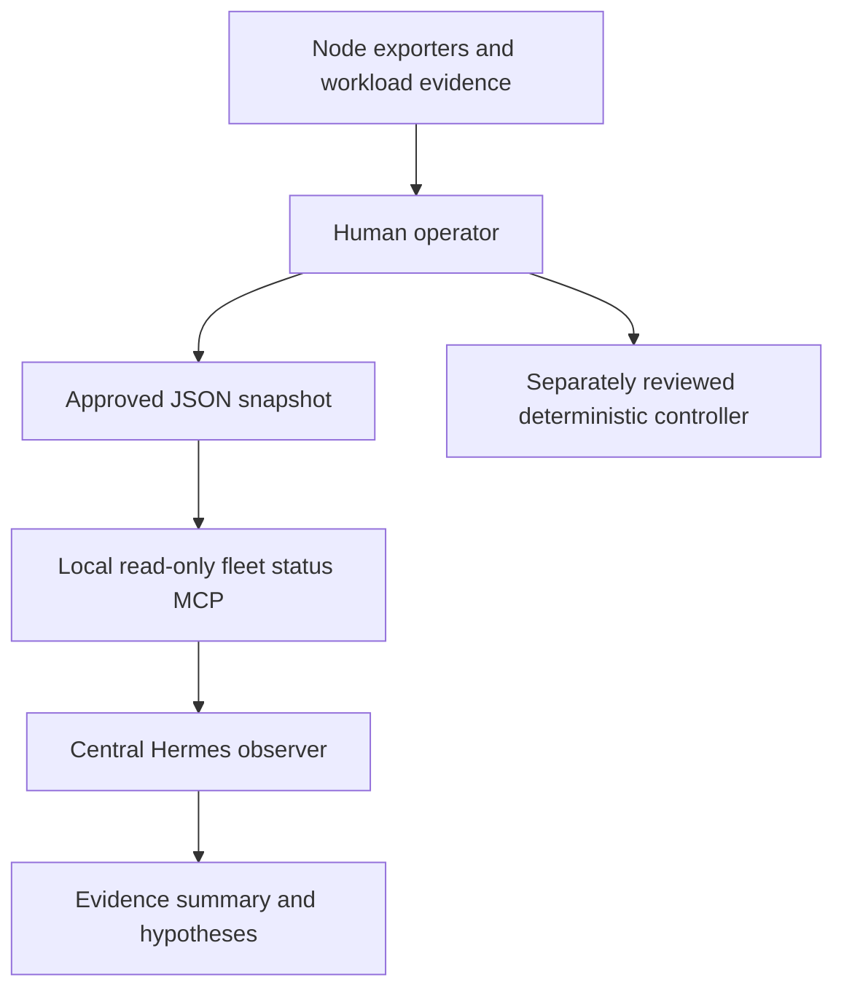

# Hermes fleet observer prototype

**Decision:** OpenClaw is prohibited on the managed environment. The repository
therefore installs one central Hermes Agent and does not deploy an agent runtime
to fleet nodes.

Hermes is not a drop-in replacement for OpenClaw's Gateway, Node Host, pairing,
or device-status-only command surface. The approved prototype remains
read-only: deterministic exporters and workload supervisors produce evidence;
an operator supplies that evidence to a central Hermes session for explanation.
Restricted SSH is a future adapter requiring its own reviewed inventory, key
policy, command allowlist, audit trail, and retry budget.

## Installation scripts

The legacy filenames are retained temporarily so existing operator references
do not silently fall back to OpenClaw:

```powershell
.\scripts\openclaw\Install-OpenClawSuperAdmin.ps1
```

The central installer requires PowerShell 7.4+ and Python 3.11-3.13. It creates
an isolated virtual environment, installs Hermes Agent release `0.21.5` from
the exact upstream commit
`749220ef0007f8d87bd1531f1c24b0fe93816385`, resolves Python dependencies
through the configured pip index, checks the installed VCS provenance and
reported version, configures
manual command approval plus deny-on-cron/single-query/unattended defaults, and
creates a read-only observer workspace. It does not pipe a mutable remote
installer into PowerShell, configure a model provider, collect credentials,
start a gateway, or enable remote execution.

On Windows, the pip/git subprocess receives a process-scoped
`core.longpaths=true` override because the upstream documentation tree exceeds
the legacy path limit. The installer restores the prior environment afterward
and does not change global Git configuration.

After installation, run the printed `hermes setup` command interactively to
choose a model provider. The current machine uses the GitHub Copilot provider.
Start with only the `clarify` toolset. The workspace `AGENTS.md` is an
instruction boundary, not an OS security boundary; adding terminal, file,
browser, cron, computer-use, or SSH access requires separate review.

The first reviewed integration is the local
[read-only fleet status MCP](fleet-status-mcp.md). It reads an operator-approved
JSON snapshot and exposes only `list_nodes`, `get_node_status`, and
`get_job_progress`. It does not connect to nodes or execute actions.

The superadmin profile may use up to four temporary local leaf subagents for
parallel evidence analysis. They inherit only the parent's read-only MCP
surface, cannot recursively delegate, and auto-deny dangerous command
approvals. They are not services installed on fleet nodes.

The former node installer now fails closed:

```powershell
.\scripts\openclaw\Install-OpenClawNode.ps1
```

It installs nothing and explains that Hermes has no compatible Node Host. Keep
node_exporter, supported GPU telemetry, and systemd or the platform service
manager responsible for health evidence and workload liveness. Do not infer
that Hermes SSH support supplies OpenClaw pairing, least privilege, durable job
ownership, or safe robot control.

Both scripts remain operator-approved deployment actions. `-WhatIf` is
available on the central installer. Normal installs reevaluate the pinned
source; `-Force` also reinstalls dependencies. Neither weakens approvals or
enables tools.

## Prototype boundary



- Hermes receives evidence through a local MCP subprocess; it does not poll or
  control nodes in this slice.
- Reachability, host health, and workload health remain separate claims.
- Missing or stale evidence is reported as unavailable or stale, never healthy.
- No automatic motion, stop/kill, restart, re-arm, or workload reassignment.
- Laptop, network, or Hermes failure must not stop node workloads.

The [fleet design](fleet-architecture.md) remains the governing proposal for
telemetry, deterministic supervision, safety, recovery budgets, and future
restricted control.
