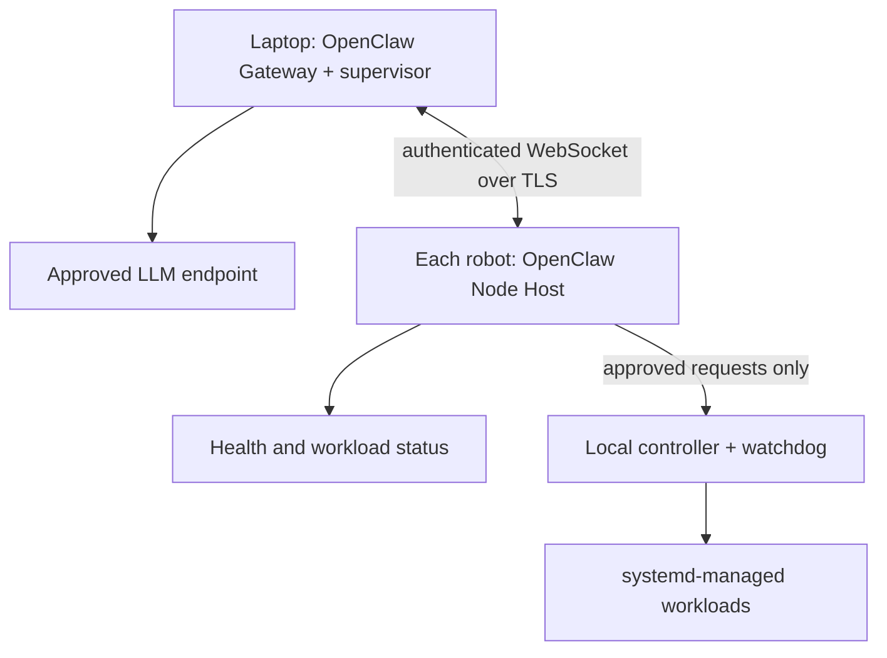

# OpenClaw fleet prototype

**Recommendation:** One OpenClaw Gateway on your laptop, with a lightweight
Node Host on each of your 10-15 machines. **No LLM on the robots.**

Proposal only: nothing installed or measured.

## Architecture

| Component | Job |
|---|---|
| Laptop Gateway | Operator interaction, diagnosis and action proposals |
| Node Host | Execute narrowly permitted operations; no model inference |
| Local controller/watchdog | Enforce permissions, persistent retry limits and recovery |
| systemd | Keep workloads independent of OpenClaw sessions |
| Telemetry | Host/GPU metrics and actual application progress |

**Why OpenClaw:** its native Gateway-to-Node topology fits this setup. Lower
RAM/CPU usage than Hermes is **not established**.

## Essential rules

- Start **read-only**. Later, allow only registered workload actions with human
  approval and local policy enforcement. No unrestricted shell or root access.
- Restrict permissions **before pairing**: current docs describe default node
  execution as `full` / `ask: off`. Disable unused browser/plugin features.
- Keep one recovery owner, durable retry budgets and command deduplication.
  Do not blindly retry unknown actions or reassign an unreachable robot's job.
- No automatic robot motion, stop/kill, restart or re-arm. Physical safety stays
  independent of fleet software.
- Laptop sleep, network loss or OpenClaw failure must not stop local workloads.
  Continuous monitoring/alerts need an always-on host.

Use node_exporter for host metrics, supported DCGM/`nvidia-smi` for discrete
GPUs, and version-matched `tegrastats` for Jetson. A connected node or live PID
does not prove useful progress; show stale/unknown data explicitly.

## First prototype

1. Pin compatible OpenClaw/Node.js versions and pair **one Jetson bench device**.
2. Read health and progress for one non-actuating workload.
3. Test laptop sleep, disconnects and Node Host restarts: the job must continue.
4. Before enabling recovery, test approvals, duplicate commands, persistent
   retry limits and protected-action denial.
5. Measure RAM, CPU, reconnect behaviour and workload impact over 24 hours.
   Expand only after review; this is not proof of months-long reliability.

If comparing Hermes, run **central Hermes + SSH** against **central OpenClaw +
Node Host**, sequentially on the same Jetson with identical workloads and local
services. Compare both against a no-agent baseline, not a local-LLM deployment.

**Bottom line:** OpenClaw provides centralized assistance and remote execution.
Deterministic local services keep the machines and jobs reliable.

## Details and sources

The [fleet design](fleet-architecture.md) defines shared safety, recovery and
budget rules. This prototype replaces its SSH transport, not those rules.

Official docs, inspected 2026-09-23; recheck defaults for the pinned release:
[Node Host](https://docs.openclaw.ai/cli/node),
[execution approvals](https://docs.openclaw.ai/tools/exec-approvals),
[subagent recovery](https://docs.openclaw.ai/tools/subagents/operations).
