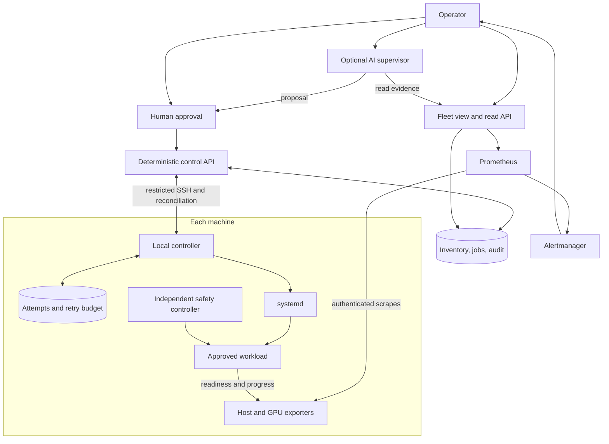

# Physical AI fleet architecture

**Status:** Proposal for [issue #1](https://github.com/rui-ren/Continuous-Foundation-Model-Integration/issues/1),
not an implemented or approved deployment. Budgets are unmeasured proposals.

**Recommendation:** Lightweight node services + deterministic monitoring and
workload supervision + a small central control plane + optional central AI.
Do not build an autonomous agent swarm.

Scope: availability and long-running jobs on 10-15 Linux workstations,
Jetsons and robots over a private network. Confirm OS/JetPack compatibility;
Windows needs a separately tested service adapter. Fleet work is independent
of CFMI's single-machine pilot and robotics research.

## 1. Architecture

> Deterministic infrastructure owns health and bounded recovery.
> AI explains evidence and proposes actions.

| Approach | Decision |
|---|---|
| LLM agent on every node | Reject: more dependencies and credentials, without durable job ownership |
| Remote shell scripts alone | Insufficient: disconnects, duplicate submissions and recovery need explicit handling |
| Local supervision + central monitoring/control | Choose: jobs survive controller and AI outages |
| Kubernetes/general scheduler | Defer until placement complexity justifies it |

Run **systemd, node_exporter and GPU telemetry** locally; **Prometheus,
Alertmanager and an inventory/job ledger** centrally. Start read-only, use
operator-selected placement, and reuse an existing dashboard or simple table.



Robot emergency stops, actuator limits and safe-state behaviour remain
independent of fleet software. No automatic motion control or re-arm.

**CFMI boundary:** [Technical design section 7.3](technical-design.md#73-job-leases)
requeues expired leases. Do not apply that rule to physical workloads: an
unreachable robot may still be running. Before sharing a scheduler, review
idempotency and enforceable fencing. This proposal does not change CFMI schemas,
gates or budgets.

## 2. OpenClaw, Hermes and alternatives

Hermes here means **NousResearch/hermes-agent**. Official sources were inspected
on 2026-09-23; pin releases and recheck support before deployment.

| Criterion | OpenClaw | Hermes Agent | Deterministic baseline |
|---|---|---|---|
| Memory/CPU | Pi guide: 1 GB machine RAM minimum, 2 GB+ recommended; not idle RSS. CPU unmeasured [S1] | No comparable measured footprint established [S5] | Measure exporters/helpers together; no local model |
| Long jobs | Interrupted subagents are not automatically resumed as durable jobs [S3] | Durable completion delivery is not execution recovery; child teardown ends child-owned processes [S6] | systemd owns processes; applications own checkpoints [S8] |
| Remote execution | Gateway routes commands to paired nodes; no local model needed [S2] | SSH/container terminal backends [S5] | Restricted SSH to a fixed controller |
| Orchestration/fanout | Node routing and delegation, not a fleet durability guarantee | Delegation/cron, not physical-job ownership | Static placement, durable attempts, bounded dispatch |
| Monitoring | Host statistics, not full GPU/app progress [S4] | Tools/scripts, not a telemetry stack | Exporters, app health, alerts and history |
| Extensions | Skills, plugins, MCP, node commands | Skills, plugins, MCP, terminal backends | Exporters and narrow workload adapters |
| Security | Pairing is not least privilege; restrict execution [S2, S4] | Approvals/sandboxing are configuration-dependent [S7] | Separate read/control identities and local allowlists |
| Hardware | ARM64/Pi documented; verify JetPack/tool binaries [S1] | Linux x86_64/aarch64 listed; not Jetson certification [S5] | Validate OS, cgroups, GPU and JetPack |

**Choice:** Start without either AI runtime. Later, evaluate one central instance
against the read-only fleet API. OpenClaw suits paired-device tooling; Hermes
suits an API/SSH-oriented environment. Neither owns job liveness or gets root
or unrestricted shell access. Available evidence does not justify a resource
ranking between them.

| Alternative | Useful for | Limitation |
|---|---|---|
| Netdata | Integrated monitoring/dashboard | Upstream typical child estimate: 100-200 MB RAM, 1-5% of one CPU core; not fleet measurements [S12] |
| Monit/site watchdog | Existing service checks | Avoid competing restart owners |
| Ansible | Repeatable deployment/configuration | Not continuous supervision |
| Nomad | Real queueing/placement needs | Adds quorum/reconciliation complexity; disconnected jobs may continue [S13] |

## 3. Node design and telemetry

Separate telemetry from control. Exporters collect metrics; systemd manages
processes; a narrow controller validates commands and persists attempts,
receipts, policies and retry budgets. Invoke it over restricted SSH initially.
Automatic recovery, when approved, uses a local watchdog through that same
controller path.

Register each workload's owner, exact unit/container, executable or image
digest, configuration, resources, startup grace, progress contract,
checkpoint/resume rules and physical-risk class. Identify executions by
unit/cgroup and process start identity, never PID alone. Unregistered processes
are observable, not controllable.

| Signal | Collect |
|---|---|
| CPU | Model, architecture, cores, utilization/load; temperature where supported |
| RAM/swap | Available memory, swap activity, cgroup pressure and OOM events |
| Disk | Free bytes/inodes, growth, read-only/I/O errors on workload and state volumes |
| GPU | Utilization, VRAM, temperature and supported power/throttle/fault indicators |
| Jetson | Shared RAM, CPU/GPU activity and supported thermal/power metrics |
| Host/network | Uptime, boot ID, last seen, probe success, RTT and interface errors |
| Processes | Cgroup totals; bounded, redacted top-process snapshots on demand |
| Workloads | Exit/readiness, progress, restart count and checkpoint age |

Use **DCGM Exporter** on supported discrete GPUs after checking driver/version
compatibility and permissions [S10]. A timeout-bounded `nvidia-smi` query is an
alternative; avoid overlapping probes or GPU-setting changes. On Jetson use
version-matched **tegrastats** and OS interfaces, with a tested parser [S11].
Shared Jetson memory is not discrete VRAM; ARM64 support does not imply
integrated-GPU DCGM support.

Propose 30-second host/GPU sampling, with bounded probe durations. Mark missing
sensors or parse failures `unavailable`, not zero. For node_exporter textfiles,
replace files atomically and expose last-progress time as a gauge value, not
a sample timestamp [S9].

## 4. Health, SuperAdmin and reporting

Track **reachability, host health and workload health separately**. Proposed
freshness limits: stale after 90 seconds; unreachable after 180 seconds while
the observer is healthy. `OFFLINE` means unreachable, not confirmed powered off.
Observer failure creates a coverage gap, not 15 machine-failure claims.
Always show observation time/source, boot ID and reason; keep never-seen nodes
visible in inventory.

Use workload-specific thresholds, dwell times and hysteresis. High GPU memory
is a warning, not a kill trigger. A live PID is not progress: use training steps,
completed requests or persisted data chunks. Account for idle inference,
startup, pauses and long checkpoint phases.

The **SuperAdmin is not a superuser**. Its deterministic service owns inventory,
capabilities, policies, job/attempt history, audit and bounded dispatch. Operators
choose placement after capacity checks; serialize GPU measurements unless a
sharing policy is approved.

Prometheus stores metrics; an event ledger preserves outages, reboots and
attempts. Alertmanager groups/routes alerts, suppresses derivative alerts during
node loss, and supports maintenance silences. Persist local transitions for
reconciliation; pull metrics cannot reconstruct lost samples.

Expose versioned JSON for fleet/node status, workloads, attempt history and
time-windowed incidents. The table and optional AI use the same read API.
Approve its schema before coding; it is not a CFMI wire-format change.

| Operator query | Evidence |
|---|---|
| Which machines are unhealthy? | Fresh health, reachability and incidents |
| Which GPU is running out of memory? | VRAM headroom/trend; Jetson shared-memory pressure separately |
| What consumes memory on Robot 04? | Cgroups plus timestamped, redacted process snapshot |
| Which training jobs are running? | Attempt ledger reconciled with unit state and progress |
| Which machines were offline in 24 hours? | Outage intervals overlapping the window, open outages and observation gaps |

The AI cites node/attempt IDs and timestamps, reports stale/unknown evidence,
and separates hypotheses from verified causes. It may summarize incidents and
suggest placements/actions, but has no write credentials.

Illustrative report, **not live evidence**:

```text
Fleet: 14 | Healthy 11 | Warning 2 | Offline 1 | Unknown 0
Robot-01       HEALTHY
Jetson-02      HEALTHY
GPU-03         WARNING    GPU memory 94%
Robot-04       WARNING    progress deadline exceeded
Training-05    OFFLINE    execution outcome unknown
... nine additional healthy machines
```

## 5. Supervision and remediation

```text
Detect -> bounded diagnostics -> classify -> validate policy/budget
       -> permitted action or escalation -> verify progress -> record
```

Diagnostics must not delay independent physical safety responses. Capture
exit/OOM events, progress, resource usage, execution identity and redacted logs.

**Proposed policy, requiring review:**

| Class | Permitted recovery | Limit |
|---|---|---|
| Telemetry service | systemd restart | 30-second delay; 3 starts per 10 minutes |
| Approved non-actuating inference | Restart exact unit after failed health checks/startup grace | 2 recovery attempts per rolling hour and per incident; 5-minute cooldown |
| Checkpointable training/data job | Verified checkpoint, unchanged inputs, previous execution confirmed stopped | Manual approval initially; later automation capped at 2 retries per logical job |
| Robot/safety-linked application | Independent safe-state response; notify human | No automatic fleet stop, kill, restart or resume; supervised re-arm |
| System/unregistered process | Read-only diagnostics | No automatic control |

The node controller is the **single recovery authority**. For newly managed
workloads, set systemd `Restart=no`, disable container retries, and route local
watchdog and central requests through one serialized path. Persist budget
consumption before authorizing a new attempt. Boot reconciliation must validate
identity, checkpoint and budget before resume; do not directly auto-enable
attempt units. Observation-only enrollment must not change existing robot boot
or safety behaviour.

Counters and cooldowns survive reboot, controller restart and new command IDs.
Budget resets require audited operator approval. Missing/corrupt accounting
blocks new recovery, not existing safe work. Verify stable readiness **and
progress**, not just process start.

Gracefully stop/checkpoint the exact registered execution first. Forced kill
requires explicit permission for a non-actuating workload; otherwise escalate.
Protect system, SSH/network, storage, credential and safety services, including
against implicit watchdog/stop-timeout kills. No `killall`, PID-only kills,
reboots, driver resets, checkpoint deletion or broad cleanup.

Test cgroup resource limits before enforcement: hard limits can cause OOM.
Escalate unknown faults, repeated crashes, failed recovery, exhausted budgets,
missing checkpoints, hardware faults and stale safety evidence. AI cannot
change thresholds, budgets, allowlists or approvals.

## 6. Protocol and security

Use private LAN/VPN connectivity, authenticated exporter scrapes or tunnels,
and host-key-verified SSH. A dedicated forced-command account accepts bounded
JSON on stdin to one fixed controller; disable shell, PTY, forwarding and
arbitrary subsystems.

Requests identify command, node, workload, job/attempt, action, expected
execution generation, policy digest, actor/approval and expiry. Approvals bind
the exact target/action/configuration. Only registered definitions supply
executables, arguments and paths; validate again on the node.

**Execution rules:**

1. Persist/reserve each command and attempt before starting its exact unit.
   Delivery is at least once: identical duplicates return the recorded result;
   conflicting content is rejected. Acknowledgment is not completion.
2. Reconcile crash windows with actual unit/container state. Unknown outcomes
   are not blindly retried; a fresh command ID cannot bypass an existing job.
3. Retain active-job identities and terminal deduplication records for the
   replay horizon. Reject expired/unsupported requests. After restore or data
   loss, disable mutations until local and central state agree.
4. Use UTC for correlation and monotonic deadlines within a boot. Uncertain
   clocks or reboot cooldown accounting block new mutations pending review.
   Late telemetry may fill history, never renew current liveness.
5. During partitions, pre-authorized work follows local safety policy. Do not
   place work on stale nodes or replace unknown executions until the original
   is confirmed stopped or physically fenced. A database generation is not
   such a fence; exactly-once physical effects are not claimed.

Separate observer, operator, approver and executor roles. AI is read-only;
nodes report only their own state. Use node-scoped credentials and a non-root
controller with narrowly authorized access to exact units. No wildcard sudo,
Docker socket access, writable workload definitions or arbitrary environment
injection for AI/telemetry.

Pin packages/images, verify host keys, firewall management surfaces, and rotate
credentials. Audit accepted/denied actions with actor, approval, request digest,
policy, target and outcome. Authentication does not make a compromised node's
telemetry trustworthy.

Redact logs/process arguments before storage and AI use; exclude secrets and
raw environments. Send only approved excerpts to an authorized model endpoint.
Treat logs/model output as data, never instructions; disable autonomous
plugin installation and unrestricted SSH tools.

## 7. Failure recovery

| Failure | Response |
|---|---|
| Telemetry/controller process crash | Restart management within its budget; no dependency may stop workloads |
| Central service outage | Local work continues; pause dispatch, restore and reconcile |
| AI outage | Only conversational assistance stops; deterministic operations remain available |
| Network loss | Mark unreachable/unknown, retain bounded events, reconcile; no blind rescheduling |
| GPU OOM | Preserve failure/checkpoint; no unapproved same-config retry, precision/batch change or migration |
| RAM exhaustion | Identify OOM victim; use tested isolation/headroom; recover only within policy and capacity |
| Disk/inode exhaustion | Refuse new work, rotate only approved logs, preserve checkpoints/failure evidence |
| Container crash or unhealthy inference | One recovery owner; approved restart after diagnostics, verified health before traffic |
| Hung training/data collection | Phase-aware progress deadline; checkpoint-aware recovery or escalation |
| Robot application crash | Independent safe state and human response; no automatic re-arm |
| Unexpected reboot | Record interruption; reconcile attempts/checkpoints/budgets before permitted resume |
| GPU fault/overheating | Quarantine from new placement; alert, no automatic driver reset/power-cycle |

Cap logs/spools and reserve space for incidents/audit. Drop/coalesce ordinary
samples first. If durable accounting cannot be written, flag evidence loss,
block new mutations and alert locally.

The central host is a single point of visibility/new dispatch, not job liveness.
Monitor it from outside that host. Test backup restore against jobs started
after the backup; absence from restored state does not prove a job is absent.

## 8. Deployment and budgets

Use native systemd/exporter packages on nodes, validating actual JetPack/cgroup
support without changing drivers to match workstations. Central services can
use containers or systemd on a reliable non-robot host. Use SQLite on local
storage for the single-writer job/event ledger; Prometheus owns time series.
Start with one dispatcher, one command at a time per node and a bounded global
limit. Never run untrusted PR code on credentialed/self-hosted GPU workers.

Proposed retention: 7 days local logs, 30 days metrics, 90 days incidents/audit,
subject to byte caps and preservation requirements. Active jobs, budgets and
deduplication records must survive longer, including months-long jobs.

| Measurement | Proposed pilot target, not an achieved result |
|---|---|
| Node overhead | Average CPU below 1% of one core; p95 summed management RSS below 150 MiB |
| Workload interference | At most 2% throughput/latency regression in matched runs; report uncertainty |
| GPU/network/disk | No local model; measure collector effects, bytes/day, spool peaks and log growth |
| Robots | Verify control deadlines and independent safety behaviour, not CPU averages alone |

Include helpers/collectors, peaks and shared-memory double counting. Measure
idle/load, restarts, queries, disk pressure and disconnection. Review targets
before rollout; reduce collection cost rather than silently relaxing limits.

## 9. MVP plan

Start on a non-actuating workstation, then a Jetson bench, then approved robots.

| Phase | Deliverable and exit evidence |
|---|---|
| 0. Approvals | Inventory, owners, workload/safety classes, supported versions, allowlists, budgets, alert recipients and data policy |
| 1. Read-only monitoring | Exporters, fleet table and outage history; correct unknown/gap handling and measured overhead |
| 2. Local supervision | One workload with progress/checkpoints and persistent budgets; crash, hang and reboot recovery |
| 3. Restricted control | Reviewed schema, approvals, command journal and reconciliation; duplicate/expired requests denied or deduplicated |
| 4. Staged rollout | Canary/rollback, external controller monitor and restore drill; proposed 72-hour bench soak then 7-day pilot |
| 5. Optional AI | Five example queries match the read API, cite evidence and report unknowns; malicious log text cannot trigger writes |

Before enabling control, drill independent AI/controller/telemetry outages,
node versus observer network loss, dispatch/start crash windows, budget exhaustion
followed by reboot, live-but-stalled processes, OOM/disk/container failures,
old-backup restore and protected-action denial. Robot bench reboot must not
cause automatic motion/re-arm.

Give alerts human owners and recovery runbooks. Monitoring rollback must not
restart workloads. Stop if availability worsens. A short soak is not proof of
months-long reliability; track interruptions, false alerts and recovery outcomes.
Untested hardware remains blocked/not run.

## 10. Keep deterministic; grow only when needed

| Deterministic | Optional AI |
|---|---|
| Health/progress checks, telemetry, limits and alerts | Evidence-based queries and incident summaries |
| Ownership, admission, checkpoints and retry budgets | Placement and recovery suggestions |
| Authorization, audit and protected actions | Diagnostic hypotheses and cross-machine analysis |
| Independent local safety | No physical-control authority |

Do not initially build local LLMs, agent negotiation, custom metrics storage or
dashboards, brokers, consensus, automatic discovery/migration, self-modifying
recovery, driver/OS updates or autonomous publication.

| Measured need | Next step |
|---|---|
| More sites/poor inbound access | Site collection and outbound mTLS; preserve command semantics |
| Queue/placement contention | Evaluate Nomad; require fencing before replacement |
| Controller recovery misses its objective | Tested standby/HA with one active dispatcher |
| Metrics exceed one host | Remote storage/aggregation; retain coverage attribution |
| More robot types | Versioned capabilities and separate safety reviews |

Implementation requires approval of the inventory, restart classes,
checkpoint/progress support, management host, data/model boundary and budgets.
This proposal authorizes no installation, robot control or policy changes.

## Sources

Official documentation inspected 2026-09-23; upstream resource guidance is not
a local benchmark.

- **S1:** [OpenClaw Pi/ARM64 requirements](https://docs.openclaw.ai/platforms/raspberry-pi).
- **S2:** [OpenClaw node execution and approvals](https://docs.openclaw.ai/nodes/node-host).
- **S3:** [OpenClaw subagent recovery](https://docs.openclaw.ai/tools/subagents/operations).
- **S4:** OpenClaw [node status](https://docs.openclaw.ai/nodes/pairing-and-status) and [security](https://docs.openclaw.ai/gateway/security).
- **S5:** Hermes [repository](https://github.com/NousResearch/hermes-agent), [installation](https://hermes-agent.nousresearch.com/docs/getting-started/installation), [platforms](https://hermes-agent.nousresearch.com/docs/getting-started/platform-support) and [tools](https://hermes-agent.nousresearch.com/docs/user-guide/features/tools).
- **S6:** [Hermes delegation/process lifetime](https://hermes-agent.nousresearch.com/docs/user-guide/features/delegation).
- **S7:** [Hermes security](https://hermes-agent.nousresearch.com/docs/user-guide/security).
- **S8:** systemd [services](https://www.freedesktop.org/software/systemd/man/latest/systemd.service.html) and [resource controls](https://www.freedesktop.org/software/systemd/man/latest/systemd.resource-control.html).
- **S9:** [node_exporter](https://github.com/prometheus/node_exporter) and [Alertmanager](https://prometheus.io/docs/alerting/latest/alertmanager/).
- **S10:** DCGM [support](https://docs.nvidia.com/datacenter/dcgm/latest/installation.html) and [Exporter deployment](https://docs.nvidia.com/datacenter/dcgm/latest/installation/install-dcgm-exporter.html).
- **S11:** [Jetson R36.4.4 tegrastats](https://docs.nvidia.com/jetson/archives/r36.4.4/DeveloperGuide/AT/JetsonLinuxDevelopmentTools/TegrastatsUtility.html).
- **S12:** Netdata [RAM](https://learn.netdata.cloud/docs/netdata-agent/resource-utilization/ram) and [CPU](https://learn.netdata.cloud/docs/netdata-agent/resource-utilization/cpu) estimates.
- **S13:** Nomad [architecture](https://developer.hashicorp.com/nomad/docs/architecture) and [disconnect policy](https://developer.hashicorp.com/nomad/docs/job-specification/disconnect).
