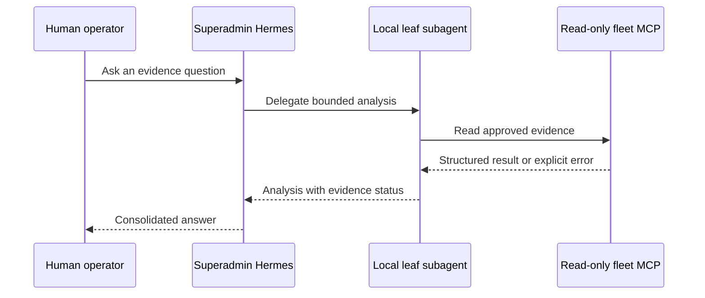
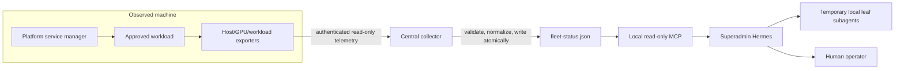

# Hermes fleet communication design

**Status:** Architecture guidance, not an implemented or approved remote
deployment.

## Short answer

The temporary Hermes subagents configured on the superadmin machine already
communicate with their parent locally. They are short-lived child processes on
the same machine, inherit only the read-only `cfmi_fleet_status` MCP, return
analysis to the parent session, and then exit. They are not installed on fleet
machines and do not use a network protocol.

Remote machines should not run autonomous Hermes agents that exchange prompts
with the superadmin. The reviewed design is:

```text
machine exporter -> authenticated collector -> atomic fleet-status.json
                 -> read-only MCP -> superadmin Hermes -> local leaf subagents
```

This is moderately difficult infrastructure work. The data flow is simple, but
safe source identity, transport authentication, freshness, schema validation,
secret distribution, firewall rules, failure semantics, and operating-system
support must be implemented and tested. Installing Hermes on every machine
does not provide any of those properties.

## Terminology

| Component | Location | Current state | Responsibility |
|---|---|---|---|
| Superadmin Hermes | This operator laptop | Configured | Explain read-only evidence and coordinate local analysis |
| Local leaf subagent | This operator laptop | Configured, temporary | Analyze a bounded question with the parent's read-only tools |
| Fleet exporter | Each observed machine | Proposed | Emit deterministic host, GPU, and workload evidence |
| Central collector | Approved central host | Proposed | Authenticate sources, validate evidence, and build a snapshot |
| Remote Hermes instance | Another machine | Optional independent local use only | Serve a human logged into that machine; not part of fleet communication |

The term **subagent** means only a temporary child of the local superadmin
session. A remote fleet machine is a **node**, not a Hermes subagent.

## What works today

The superadmin Hermes profile can create up to four temporary local leaf
subagents. Delegation is limited to one level, each one-shot request can create
at most two children, and children time out after 600 seconds of inactivity.
They inherit the four read-only fleet MCP tools but not terminal, file,
browser, cron, computer-use, messaging administration, or recursive
delegation.

The local communication path is internal to Hermes:



There is currently no `fleet-status.json`, so remote fleet questions correctly
return `RESOURCE_UNAVAILABLE`. Only the superadmin machine's physical-memory
tool returns live local evidence.

## Recommended remote data path

Use deterministic exporters and a collector rather than Hermes-to-Hermes
conversation:



The node sends facts, not instructions or model output. The collector converts
those facts into the existing
[fleet evidence contract](fleet-status-mcp.md#evidence-contract). The MCP reads
the snapshot through local stdio and opens no network listener.

For the proposed Linux fleet, the baseline is node_exporter plus reviewed GPU
and workload exporters, authenticated central scraping, and systemd ownership
of workloads. DCGM Exporter may be used only on supported discrete NVIDIA
hardware; Jetson requires a version-matched tegrastats adapter. Windows needs a
separately tested exporter/service adapter. Missing sensors and parser failures
must be `unavailable`, never zero or healthy.

## Transport and identity requirements

Choose an organization-approved private transport. The initial recommendation
is authenticated central scraping because nodes do not need model credentials
and do not initiate agent conversations. Before connecting a node, define:

- a stable inventory `node_id`, owner, machine purpose, OS, and hardware class;
- a unique machine identity; never share one fleet-wide credential;
- mutual authentication, preferably mTLS or an equivalent managed identity;
- certificate/key issuance, local storage, rotation, revocation, and expiry;
- network allowlists limiting telemetry to the collector and required ports;
- bounded request timeouts, response sizes, sampling rate, and retention;
- an explicit schema version, source timestamp, collector timestamp, and boot
  identity;
- atomic snapshot writes and rejection of invalid UTF-8, non-finite numbers,
  duplicate nodes, future timestamps, and unknown states;
- audit records for enrollment, identity changes, rejected evidence, and
  collector configuration changes.

Telemetry fields, node names, logs, and workload messages are untrusted data.
They cannot enable tools, alter prompts, or request commands. The collector and
MCP must treat instruction-like text as data.

The current `schema_version: 1` snapshot has `source` and `observed_at` fields
but no collector timestamp or boot identity. Keep additional provenance in the
collector's audit record during the pilot. Adding either field to the snapshot
requires an explicit, versioned evidence-contract change rather than silently
emitting unknown fields.

## Failure behavior

The communication path must fail visibly:

| Failure | Required result |
|---|---|
| Node stops reporting | Existing evidence becomes stale; do not report it as live or healthy |
| Collector cannot authenticate a node | Reject the update and record the reason |
| Payload is invalid or oversized | Reject it; preserve the last valid observation as last known, not live |
| Collector is unavailable | Report an observer coverage gap, not simultaneous node failures |
| Superadmin or Hermes is offline | Node workloads continue under their deterministic service managers |
| Duplicate or replayed evidence | Reject or classify it as non-current |
| Clock is more than five seconds in the future | Mark evidence invalid |

Reachability, host health, and workload health remain separate claims. A
reachable node is not necessarily healthy, and an unreachable robot may still
be running.

## One-node pilot

Do not start with every machine.

1. Select one non-actuating bench machine and record its owner and approved
   telemetry fields.
2. Choose and review the OS-specific exporter. Measure its CPU, memory, disk,
   and network overhead.
3. Establish a unique node identity and authenticated private connection to a
   test collector.
4. Validate and normalize one node's evidence into a temporary snapshot.
5. Replace `%LOCALAPPDATA%\hermes\fleet-status.json` atomically only after the
   entire snapshot passes schema validation.
6. Verify live, stale, disconnected, invalid, replayed, oversized, and
   malicious-text cases through the MCP.
7. Confirm that no node credential, terminal, SSH command, mutation endpoint,
   or model-provider token is available to Hermes.
8. Review pilot evidence and operating cost before enrolling a second node.

Acceptance requires measured evidence lag and overhead, correct failure
classification, identity rotation/revocation, and proof that node workloads
survive collector and superadmin outages.

## Why direct Hermes-to-Hermes messaging is deferred

A direct agent protocol would add remote prompt injection, session identity,
authorization, replay protection, message persistence, delivery retries,
version compatibility, resource budgets, credential rotation, and audit
requirements. It still would not provide durable job ownership or reliable
health telemetry.

Hermes plugins, messaging adapters, A2A features, SSH, or terminal backends are
not approved substitutes for the collector path. Any future bidirectional
control plane must be a separately reviewed deterministic API with human
approval, command allowlists, durable attempt records, bounded retries, and
independent robot safety controls. It must not reuse the read-only telemetry
identity.

## Non-goals

- No autonomous agent swarm or recursive remote delegation.
- No shared model credentials on nodes.
- No remote shell, restart, kill, re-arm, motion, or workload reassignment.
- No automatic discovery or enrollment.
- No inference that installing Hermes on a node connects it to the superadmin.
- No fleet-wide rollout until the one-node pilot is approved.

See [Physical AI fleet architecture](fleet-architecture.md) for the broader
monitoring and deterministic-control proposal and
[Reproducing the Hermes Agent configuration](hermes-installation.md) for
independent local Hermes installation.
