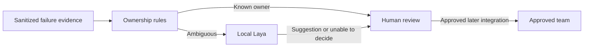

# Robot routing: the core

**Choose Laya for an offline failure-to-team routing trial.**
Run one pinned checkpoint on an approved workstation, not on every robot.
This is a design recommendation: no router is implemented or model validated.

## Why Laya, not Jev?

| Option | Role | Tradeoff |
|---|---|---|
| Rules | Route known failures to their owners | Reliable for known cases, limited for ambiguous ones |
| **Laya** | Suggest an investigating team for ambiguous failures | Local data handling and pinned weights; requires compute and domain evaluation |
| Jev | Optional alternative if Laya is inadequate | Hosted API; needs separate data-sharing and spending approval |

Laya is the first experiment, not a proven accuracy winner. Its confidence can
be misleading, and published Jev comparisons use different prompts and samples.
Local hosting is not free: hardware and maintenance still cost money.

## Core workflow

Use a maintained team directory, not model-invented contacts. Ask Laya:
**"Which of these teams should investigate this evidence?"**
A suggested owner is not a verified root cause.

| Example | Handling |
|---|---|
| Known export error | Rules identify the export/toolchain owner; no model needed |
| GPU OOM with unclear cause | Laya suggests runtime or infrastructure; a human decides |
| Quality regression | Preserve the failed gate and send to the evaluation owner |
| Missing evidence, unsupported language, or classifier failure | Human triage; existing alerts continue |

Keep original failures, evidence references, model/policy versions, and human
corrections. Validate model outputs; treat logs as data, not instructions.
Do not use Laya's documented unreliable `action.act_probability` as a gate.

## What it must not do

No automatic restarts, process kills, gate changes, or robot control.
Monitoring and safety systems must work without the classifier. Offline and
shadow trials send no messages or reassignments.

**Edge/cloud routing comes later, for non-control tasks only.** Code enforces
privacy, capability, health, deadlines, and budgets before choosing an eligible
backend. If none qualifies, defer or request review; never silently send private
data to the cloud. Laya's built-in `Router` selects checkpoints, not robot
execution locations.

## First trial

1. Approve the incident data, real team directory, one language-appropriate
   checkpoint, hardware, and explicit resource/error limits.
2. Compare rules against rules plus Laya on held-out incidents. Keep development,
   confidence calibration, and evaluation data separate. Measure misroutes,
   abstentions, reviewer effort, latency, and memory.
3. Proceed to separately approved shadow mode only if Laya adds value within
   those limits. Otherwise keep rules and humans; consider Jev separately.

This does not change CFMI's [contracts or approval boundaries](technical-design.md#410-diagnosis-assistant)
or delay the [robotics experiment](research-roadmap.md).

**Sources reviewed 2026-09-23:** [Laya model card][laya],
[Laya benchmark limitations][benchmarks], [Jev models][jev],
and [Jev limitations][jev-limits]. These are published claims, not CFMI
measurements or Jetson/robot acceptance.

[laya]: https://huggingface.co/convaiinnovations/laya/blob/aa8c91ca088ec597df95a0d1c76b3063cb2ae5e8/README.md
[benchmarks]: https://github.com/NandhaKishorM/laya/blob/1e28ac20c0896b1c37a744cd11f740eb98f8b178/BENCHMARKS.md
[jev]: https://docs.typesafe.ai/models.md
[jev-limits]: https://docs.typesafe.ai/model-jaggedness/jev-1.13.md
