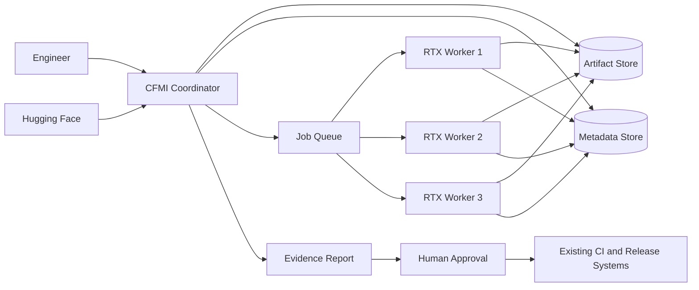
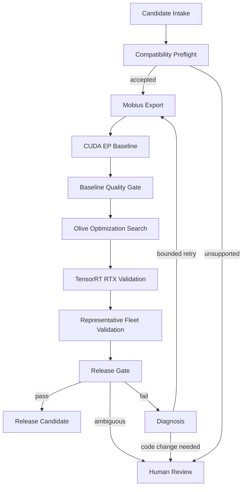

# CFMI Technical Design

## Delivery scope

The immediate deliverable is a bounded single-machine experiment using one
pinned model, CUDA EP, TensorRT RTX EP, one reviewed optimization configuration,
and a reproducible evidence report. Prefer existing scripts or CI with persisted
run state and checksummed artifacts. Separate coordinator, metadata, dashboard,
and worker services are not required.

The distributed architecture and fleet mechanisms below are an expansion
blueprint, not prerequisites for the first experiment. Its target matrix has
one required hardware class; `FLEET_VALIDATION` initially validates that single
declared target rather than implying three workers. Adding targets or services
requires a separately approved scope and budget.

Robotics research proceeds independently in parallel; see the
[research roadmap](research-roadmap.md#immediate-research-focus). CFMI completion,
agent diagnosis, and fleet deployment do not gate the first policy experiment.

## 1. Design principles

1. **Workflow before agents.** A durable state machine owns orchestration.
   Agents may recommend actions but cannot redefine gates.
2. **Evidence before decisions.** Every decision references structured metrics,
   artifacts, and environment provenance.
3. **Reproducibility before throughput.** A slower comparable result is more
   valuable than a fast ambiguous result.
4. **Bounded autonomy.** Retries, optimization experiments, time, and compute
   have explicit budgets.
5. **Human-controlled changes.** Code changes, pull requests, package
   publication, and releases require approval during the pilot.
6. **Hardware-aware comparison.** Performance is compared only within compatible
   hardware and software buckets.
7. **Idempotent stages.** Repeating a stage with identical inputs must not
   corrupt state or create conflicting release decisions.
8. **Extensible execution providers.** NVIDIA is the first implementation, not
   a permanent orchestration dependency.

## 2. System context



The coordinator is the source of truth for workflow state. Workers are
replaceable executors and do not make release decisions.

## 3. Logical architecture



### 3.1 Generic lifecycle boundary

The concrete NVIDIA pipeline is one implementation of a generic closed-loop ML
lifecycle:

```text
CandidateProvider
        |
        v
Transformer
        |
        v
Optimizer
        |
        v
Executor
        |
        v
Evaluator
        |
        v
Remediator
        +----------> bounded retry
```

The coordinator depends on these contracts rather than directly on Hugging
Face, Mobius, Olive, ONNX Runtime, or TensorRT RTX:

```text
CandidateProvider.discover(query) -> Candidate[]
CandidateProvider.resolve(candidate) -> immutable Candidate

Transformer.check(candidate, target) -> CompatibilityReport
Transformer.transform(candidate, configuration) -> Artifact

Optimizer.plan(artifact, constraints, budget) -> ExperimentPlan
Optimizer.optimize(artifact, experiment) -> Artifact

Executor.prepare(artifact, target) -> Deployment
Executor.execute(deployment, workload) -> ExecutionResult

Evaluator.evaluate(execution, suite, policy) -> EvaluationResult

Remediator.diagnose(failure, evidence) -> Diagnosis
Remediator.propose(diagnosis, remaining_budget) -> RemediationPlan
```

The contracts are generic, while pilot implementations remain narrow:

| Contract | NVIDIA inference pilot |
|---|---|
| `CandidateProvider` | Explicit pinned Hugging Face model |
| `Transformer` | Mobius ONNX export |
| `Optimizer` | Reviewed Olive optimization plan |
| `Executor` | CUDA EP and TensorRT RTX EP |
| `Evaluator` | Accuracy, functionality, latency, throughput, and memory |
| `Remediator` | Known fixes plus evidence-grounded diagnosis assistant |

### 3.2 Domain model

The coordinator stores domain entities rather than ONNX-specific file paths:

```text
Candidate
    id
    source
    immutable revision
    architecture
    modality
    metadata and policy attributes

Artifact
    id
    type
    format
    version
    parent artifacts
    transformation provenance
    compatibility requirements
    content checksums

Target
    runtime
    hardware class
    environment
    capabilities

Experiment
    parent artifact
    transformation or optimization
    configuration
    resource budget
    result

Evaluation
    suite and revision
    policy and revision
    metrics
    traces
    failures
    decision
```

An `Artifact` may be an ONNX graph or TensorRT engine in the pilot. The contract
must also be able to represent a checkpoint, adapter, policy, compiled engine,
or other versioned model product without changing coordinator state semantics.

### 3.3 Interactive evaluation

The evaluator must not assume that evaluation is a static input/output
comparison. It supports both batch evaluation and environment interaction:

```text
Evaluator input:
    artifact or deployment
    target environment
    evaluation suite
    gate policy

Evaluator output:
    metrics
    traces or trajectories
    generated artifacts
    typed failures
    deterministic gate inputs
```

The inference pilot uses finite datasets and request workloads. A future VLA
implementation may run multi-step episodes in simulation or on hardware. In
both cases, the gate evaluator receives structured evidence and remains
independent of how that evidence was generated.

## 4. Components

### 4.1 Candidate intake

Candidate intake accepts an explicit manifest during the pilot. Automated model
discovery is deferred until the onboarding pipeline is reliable.

Responsibilities:

- Validate required fields and immutable model revision.
- Verify repository allowlist, license metadata, and access.
- Assign a globally unique run identifier.
- Snapshot the requested constraints and target matrix.
- Reject mutable revisions such as unpinned branch names.

### 4.2 Compatibility preflight

Preflight prevents obviously unsuitable jobs from consuming fleet resources.

Checks include:

- Architecture and task match the pilot allowlist.
- Parameter count and estimated memory fit at least one target worker.
- Required custom code and remote-code policy.
- Tokenizer and configuration files are present.
- Opset, precision, dynamic-shape, and runtime prerequisites are known.
- Model license and use restrictions are recorded.
- Required evaluation datasets are available.

Output:

```json
{
  "decision": "ACCEPT",
  "reasons": [],
  "estimated_resources": {
    "minimum_vram_mb": 6144,
    "estimated_export_disk_mb": 12000
  },
  "required_capabilities": [
    "cuda-ep",
    "tensorrt-rtx",
    "fp16"
  ]
}
```

### 4.3 Workflow coordinator

The coordinator:

- Applies the state transition rules.
- Creates jobs with immutable inputs.
- Leases jobs to compatible workers.
- Enforces retry and experiment budgets.
- Records approvals and terminal decisions.
- Generates the final evidence bundle.

The coordinator must not execute model workloads directly.

### 4.4 Worker service

Each laptop runs a worker service under a dedicated identity.

Responsibilities:

- Register hardware and software capabilities.
- Accept only jobs matching its capability manifest.
- Prepare or select an isolated, pinned environment.
- Download verified inputs and upload checksummed outputs.
- Stream structured status, logs, and measurements.
- Renew the job lease and stop work if ownership is lost.
- Clean temporary data according to retention policy.

Workers must tolerate coordinator restarts and network interruption.

### 4.5 Mobius export adapter

The adapter wraps the existing Mobius export operation behind a stable contract:

```text
export(model_snapshot, export_configuration)
    -> onnx_artifact
    -> export_report
    -> external_data_artifacts
```

The report records:

- Source model and immutable revision
- Exporter and dependency versions
- Opset and graph configuration
- Input/output signatures and dynamic dimensions
- Warnings and unsupported operations
- Artifact checksums and sizes
- Duration and peak host/GPU memory

### 4.6 Execution-provider adapters

All execution providers implement a common conceptual interface:

```text
capability_check(model, worker) -> compatibility_report
prepare(model, configuration) -> executable_artifact
run(executable_artifact, evaluation_input) -> output
benchmark(executable_artifact, benchmark_plan) -> measurements
collect_diagnostics() -> diagnostic_bundle
```

#### CUDA EP adapter

CUDA EP is the pilot correctness baseline. It validates:

- Source-to-export parity against a pinned reference implementation, with
  identical preprocessing and evaluation inputs and versioned tolerances
- Model load and session creation
- Expected input and output signatures
- Deterministic comparison where applicable
- Task-level accuracy or quality
- Required product functionality
- Basic stability and memory behavior

Require passing source-to-export parity and absolute task-quality/functionality
thresholds before optimization. Agreement between two providers executing the
same exported graph is not sufficient evidence of export correctness.

#### TensorRT RTX EP adapter

TensorRT RTX is the optimized target. It validates:

- Capability and operator support
- Engine or compiled-artifact creation
- Shape-profile coverage
- Precision configuration
- Cache compatibility and invalidation
- Task-level equivalence against the CUDA baseline
- Performance and memory improvements

An optimized result cannot pass solely because it is faster.

### 4.7 Olive optimization adapter

Optimization is expressed as a bounded experiment plan rather than unrestricted
trial and error.

Example expanded plan (the immediate experiment selects only one reviewed
configuration):

```yaml
budget:
  maximum_experiments: 4
  maximum_gpu_hours: 8
  stop_after_passing_candidate: true

experiments:
  - id: fp16-baseline
    precision: fp16
  - id: approved-quantization-path
    precision: selected-pilot-precision
    method: selected-pilot-method
```

Each experiment produces a comparable report. Search may become adaptive later,
but the first implementation should use reviewed configurations.

### 4.8 Evaluation service

Evaluation separates model quality from runtime performance.

Quality evaluation may include:

- Reference-output similarity
- Task-specific accuracy
- Perplexity or another model-family metric
- Structured output validity
- Tool/function-calling correctness
- Product-specific smoke tests

Performance evaluation may include:

- Model/session initialization time
- First-token latency
- Inter-token latency
- End-to-end latency
- Throughput
- Peak and steady-state VRAM
- Stability over repeated requests

Every metric includes units, aggregation method, warm-up policy, sample count,
and dataset version.

### 4.9 Gate evaluator

The gate evaluator is deterministic and versioned. A policy example:

```yaml
policy_version: 1

quality:
  maximum_relative_regression_percent: 1.0
  required_functional_tests: all

performance:
  minimum_throughput_improvement_percent: 10.0
  maximum_peak_vram_mb: 8192

reliability:
  minimum_successful_repetitions: 3
  allowed_crashes: 0
```

Possible decisions:

- `PASS`: all mandatory gates pass.
- `FAIL`: at least one mandatory gate fails unambiguously.
- `REVIEW`: evidence is incomplete, inconsistent, or outside policy coverage.

An agent explanation may accompany the result but cannot alter it.

### 4.10 Diagnosis assistant

The diagnosis assistant consumes only approved evidence from the failed run:

- Stage and error category
- Sanitized logs
- Model configuration and graph metadata
- Environment and worker manifest
- Similar historical failures
- Approved remediation catalog

It outputs:

- Ranked failure hypotheses with cited evidence
- Recommended next experiment or owner
- Confidence and missing evidence
- Optional patch proposal for human review

The assistant must not invent success, silently relax gates, modify protected
branches, expose secrets, or execute an unbounded retry loop.

## 5. Workflow state model

```text
SUBMITTED
  -> PREFLIGHT
  -> EXPORTING
  -> CUDA_VALIDATION
  -> OPTIMIZING
  -> TRT_RTX_VALIDATION
  -> FLEET_VALIDATION
  -> GATE_EVALUATION
  -> RELEASE_REVIEW
  -> RELEASE_CANDIDATE
```

Any executing state may transition to:

- `RETRY_PENDING` when a retryable failure has remaining budget.
- `HUMAN_REVIEW` when intervention or a source change is required.
- `BLOCKED` for an external dependency.
- `FAILED` for an exhausted or non-retryable failure.
- `CANCELLED` after an authorized cancellation.

Terminal states are immutable. A changed input creates a new run linked to the
previous run rather than rewriting its history.

## 6. Core data contracts

### 6.1 Run manifest

```yaml
schema_version: 1
run_id: generated-uuid

model:
  repository: organization/model-name
  revision: immutable-commit-sha
  family: selected-pilot-family
  license: recorded-license-id

software:
  mobius_version: pinned-version
  olive_version: pinned-version
  onnxruntime_version: pinned-version
  tensorrt_rtx_version: pinned-version

targets:
  baseline_execution_provider: cuda
  optimized_execution_provider: tensorrt-rtx
  hardware_classes:
    - rtx-4060-laptop

evaluation:
  dataset_id: approved-dataset
  dataset_revision: immutable-revision
  policy_version: 1

budgets:
  maximum_retries_per_stage: 2
  maximum_experiments: 4
  maximum_gpu_hours: 8
```

### 6.2 Worker manifest

```yaml
worker_id: stable-worker-id
hardware_class: rtx-4060-laptop

hardware:
  gpu_name: NVIDIA GeForce RTX 4060 Laptop GPU
  compute_capability: recorded-value
  vram_mb: recorded-value
  cpu: recorded-value
  ram_mb: recorded-value

software:
  os: recorded-value
  driver_version: recorded-value
  cuda_version: recorded-value
  onnxruntime_version: recorded-value
  tensorrt_rtx_version: recorded-value

capabilities:
  execution_providers:
    - cuda
    - tensorrt-rtx
  precisions:
    - fp32
    - fp16

operating_state:
  power_mode: ac
  battery_percent: recorded-value
  thermal_state: acceptable
```

### 6.3 Stage result

```json
{
  "schema_version": 1,
  "run_id": "generated-uuid",
  "stage": "CUDA_VALIDATION",
  "attempt": 1,
  "status": "SUCCEEDED",
  "input_checksums": {},
  "output_checksums": {},
  "worker_id": "stable-worker-id",
  "environment_fingerprint": "sha256-value",
  "metrics": [],
  "artifacts": [],
  "warnings": [],
  "started_at": "ISO-8601 timestamp",
  "completed_at": "ISO-8601 timestamp"
}
```

### 6.3.1 Current CPU prototype

The JSON above remains a target wire-format sketch, not an implemented
serializer. The current internal types in `src/cfmi/contracts.py` cover only
output-producing execution stages:

- `ArtifactDigest`: a non-empty name and lowercase SHA-256 hex digest.
- `Failure`: a category from section 9 and a non-empty diagnostic message.
- `StageResult`: run ID, canonical execution stage, positive attempt number,
  worker ID, environment SHA-256 fingerprint, immutable input/output digest
  tuples with unique names, status, and an optional typed failure.

Inputs identify at least the submitted manifest. `SUCCEEDED` requires output
evidence and no failure; `FAILED` and `BLOCKED` require a typed failure and may
retain partial outputs. These are stage execution statuses, not release-gate
decisions. Validate actual artifact bytes and gate metrics in future adapters;
the record validates structure only.

Serialization/schema versioning, experiment identity, timestamps, metrics,
approvals, persistent history, and budget enforcement are not implemented.
Define their mappings here before adding them. CPU tests use synthetic digests
and a fake exporter; they do not establish model or GPU correctness.

## 7. Scheduling and fleet design

### 7.1 Capability matching

A job declares required capabilities, minimum VRAM, hardware class, software
matrix, and estimated duration. The scheduler assigns only workers satisfying
all mandatory constraints.

### 7.2 Hardware classes

Workers belong to explicit comparison buckets. A class includes at minimum:

- GPU model and VRAM
- Laptop versus desktop designation
- Approved driver/runtime matrix
- Power profile

Performance regressions are evaluated against a baseline from the same class.
Cross-class results may inform capacity planning but cannot directly trigger a
performance regression.

### 7.3 Job leases

- A worker receives a time-limited lease.
- The worker renews the lease through heartbeats.
- Expired jobs return to the queue after a grace period.
- Result submission requires the current lease token.
- Duplicate results are retained for diagnosis but cannot create duplicate
  terminal decisions.

### 7.4 Laptop-specific controls

Benchmark jobs require:

- AC power
- Approved performance mode
- Acceptable starting temperature
- No conflicting GPU workload above a defined threshold
- Warm-up before measurement
- Repeated samples with outlier policy

Jobs pause or become invalid if the laptop sleeps, changes power mode, overheats,
or loses the approved environment.

### 7.5 Local Windows machine evidence

The optional Hermes Machine Doctor pilot uses deterministic local collection,
not direct model access to Windows APIs. A reviewed Python collector invokes
only fixed child probes for boot time, CPU samples, memory/commit counters,
configured local volumes, and one exact Windows service. Each child is
timeout-bounded; Hermes receives only the resulting JSON through the existing
read-only MCP.

Fleet snapshot schema version 2 is a single-node local evidence contract:

- `source` is `local-windows-machine-doctor`;
- `source_identity` binds an exact configured node ID and expected computer
  name to the observed local computer name;
- `host.status` remains `unknown` until thresholds are separately approved;
- `host.machine` contains `identity`, `boot`, `cpu`, `memory`, `disks`, and
  `service` sections;
- each probe section is `available` with typed raw evidence or `unavailable`
  with a category and sanitized reason;
- CPU evidence contains at least three timestamped samples and does not by
  itself establish a high-CPU threshold;
- `workload_evidence` is explicitly unavailable until an approved workload
  progress source exists.

Schema version 1 remains readable. Unknown versions and unknown version-2
fields are rejected. Computer-name binding is local identity validation, not
remote authentication. The collector writes a temporary UTF-8 file in the
destination directory, flushes it, and atomically replaces the prior snapshot;
collection or replacement failure preserves the last complete file.

No scheduler, listener, terminal tool, service control, or automatic remediation
is part of this pilot.

An optional manual Azure Pipelines artifact path can move one validated
schema-version-2 snapshot from the exact `ORT-GPU-BENCH-5` job to the central
observer. This is asynchronous evidence transfer, not a live agent connection:

- the export job has an exact pool/agent/identity/computer binding, checks out
  only its reviewed source revision without persisted credentials, and performs
  no installation, provider setup, gateway startup, or command handling;
- the artifact contains only `machine-status.json` and an export receipt that
  binds the pipeline name and numeric definition ID, repository type and ID,
  run ID, source revision, node, computer, exact service name, observation
  timestamp, and SHA-256 digest;
- the central importer requires an already authenticated Azure CLI session,
  verifies that the named run completed successfully under the exact export
  definition, and revalidates the strict snapshot schema and every receipt
  binding;
- successful import atomically replaces the central evidence file and writes a
  durable local import receipt; failed validation preserves prior evidence;
- snapshot age is not reset during transfer, so delayed imports remain stale.

Azure Pipelines authenticates artifact retrieval, but the artifact is not an
end-to-end signed node attestation. No arbitrary machine, run, artifact,
service, or destination inferred by Hermes is accepted.

## 8. Reproducibility and artifact management

Every artifact is content-addressed and linked to:

- Model and dataset revisions
- Source repository commits
- Export and optimization configurations
- Dependency lock or image digest
- Worker environment fingerprint
- Gate policy version

Cache hits are allowed only when all declared inputs match. Engine or compiled
artifacts must include hardware and software compatibility keys and must not be
reused outside their supported matrix.

Suggested retention:

- Release-candidate evidence: long-term
- Failed-run diagnostic bundles: medium-term
- Intermediate artifacts: configurable short-term
- Raw verbose logs: short-term unless attached to a retained failure

## 9. Reliability and error handling

Failures use a typed taxonomy:

```text
INPUT_INVALID
LICENSE_OR_POLICY_BLOCK
RESOURCE_UNAVAILABLE
ENVIRONMENT_MISMATCH
DOWNLOAD_FAILURE
EXPORT_UNSUPPORTED
EXPORT_DEFECT
RUNTIME_UNSUPPORTED
RUNTIME_DEFECT
OUT_OF_MEMORY
QUALITY_REGRESSION
PERFORMANCE_REGRESSION
FUNCTIONAL_REGRESSION
INFRASTRUCTURE_TRANSIENT
UNKNOWN_REQUIRES_REVIEW
```

Retry policies depend on category. For example:

- Network interruption may retry automatically.
- Out-of-memory may move to a compatible higher-VRAM worker if permitted.
- Unsupported operators require review or a known approved fallback.
- Quality regression does not retry with the same inputs.
- Unknown failures stop after a small bounded retry count.

Errors must remain visible in the run history; retries never overwrite prior
attempts.

## 10. Security and governance

- Use dedicated service identities and least-privilege credentials.
- Keep Hugging Face, artifact-store, and repository credentials in an approved
  secret store.
- Never include secrets in prompts, logs, artifacts, or diagnosis reports.
- Allowlist model repositories during the pilot.
- Disable unreviewed remote model code by default.
- Record model license metadata before downloading or redistributing artifacts.
- Sign or checksum artifacts and verify them at each transfer.
- Restrict workers from modifying coordinator state except through authenticated
  result APIs.
- Require human approval for source changes, pull requests, package publication,
  and releases.
- Preserve an audit trail of actor, action, timestamp, inputs, and decision.

## 11. Observability

### Metrics

- Runs by state and terminal decision
- Stage latency and queue latency
- Worker availability and utilization
- Retry and failure rates by category
- GPU hours by model and experiment
- Cache hit rate
- Accuracy and performance deltas
- Flaky or invalid benchmark rate
- Human-review frequency and resolution time

### Logs

Logs are structured and correlated by run, stage, attempt, job, and worker.
Sensitive fields are redacted before persistence or agent use.

### Traces

Distributed traces connect submission, scheduling, artifact transfer, worker
execution, and gate evaluation.

### Dashboard

The immediate report (or an optional later dashboard) should answer:

- What is running and where?
- Why is a run blocked or failed?
- Which evidence caused the decision?
- Are results comparable to the selected baseline?
- How much manual and elapsed time has been saved?

## 12. Testing strategy

### Unit tests

- State transitions and terminal-state immutability
- Manifest validation
- Capability matching
- Policy evaluation
- Retry budgets and failure classification
- Artifact compatibility and cache keys

### Contract tests

- Mobius adapter inputs and outputs
- Olive experiment reports
- CUDA and TensorRT RTX adapter behavior
- Worker registration, lease renewal, and result submission

### Integration tests

- Small approved model through the single-machine pipeline
- Interrupted worker and lease recovery
- Invalid environment rejection
- Failed quality gate despite improved performance
- Unsupported operation routed to human review

### End-to-end pilot tests

- Successful model onboarding
- Intentional export failure
- Intentional accuracy regression
- Worker disconnect during execution
- Repeated run demonstrating equivalent gate outcome

## 13. Release policy

A release candidate requires:

- Immutable and permitted source revision
- Successful export with checksummed artifacts
- Passing CUDA EP baseline
- Passing optimized-path quality and functionality gates
- Passing required hardware-class validation
- Complete environment and artifact provenance
- No unresolved mandatory warnings
- Human approval

The pilot produces release candidates only. Existing release systems remain the
authority for publication and deployment.

## 14. Evolution after the pilot

Choose expansions incrementally based on measured need. These are options,
not a sequence that must finish before robotics experimentation:

1. Add more models within the initial architecture family.
2. Add three-class validation, then a larger RTX fleet only if justified.
3. Add another architecture family.
4. Add adaptive optimization search using historical results.
5. Add reviewed patch and pull-request generation.
6. Add package rebuild and product integration validation.
7. Add another execution provider through the common adapter.
8. Add automated Hugging Face discovery and candidate scoring.
9. Extend to multimodal, VLM, VLA, or world-model workloads where evaluation is
   sufficiently defined.

Each expansion requires a supported matrix, evaluation policy, resource budget,
and owner.

The robotics extension is not implemented by replacing ORT with Jetson. It
introduces new implementations of the generic contracts:

| Contract | Future robotics implementation |
|---|---|
| `CandidateProvider` | Training pipeline or checkpoint registry |
| `Transformer` | VLA exporter or compiler |
| `Optimizer` | Quantization, TensorRT compilation, action/runtime tuning |
| `Executor` | Jetson or another robot compute target |
| `Evaluator` | Isaac Lab, hardware-in-loop, and robot task suites |
| `Remediator` | Configuration changes, data requests, or reviewed training actions |

Training, teleoperation, and data acquisition remain outside the pilot. If
later introduced, they are explicit, budgeted remediation actions that create a
new versioned candidate; they do not mutate an existing run or artifact.

## 15. Open decisions before implementation

These decisions should be resolved during Phase 0:

- Initial model family and representative model
- Exact ORT, CUDA, TensorRT RTX, Mobius, and Olive versions
- One initial GPU target and pinned environment
- Evaluation datasets and legally permitted storage
- Accuracy and functionality metrics
- Benchmark protocol and acceptable variance
- Existing artifact storage and persisted run-record format
- Script or CI reuse with explicit transitions and bounded retries
- Local execution isolation approach
- Ownership for runtime defects and generated patch review
- Retention, security, and release-approval requirements

Select additional hardware classes, distributed storage/services, and worker
lease infrastructure only when a fleet expansion is approved. Resolve the
[engineering contract refinements](engineering-design.md#7-first-detailed-design-session)
needed for the selected scope before implementation; do not implement the
entire expansion blueprint in Phase 0.

## 16. Pilot acceptance criteria

The single-machine implementation is technically complete when:

1. A pinned model revision completes every required stage.
2. The run produces a reproducible evidence bundle and release recommendation.
3. Source-to-CUDA correctness and TensorRT RTX optimization are evaluated under
   versioned policies with explicit quality thresholds.
4. The selected RTX target produces complete artifact-bound quality and
   performance evidence under controlled benchmark conditions.
5. Local interruption does not lose run history or cause duplicate decisions.
6. An intentional quality regression is blocked.
7. A failed stage produces an actionable, evidence-grounded diagnosis.
8. No protected source or release action occurs without explicit approval.

The pilot is successful as a business investment only if it also demonstrates
material improvement over the measured manual baseline.

The time-boxed experiment ends with a results report at the agreed 4-6 week
checkpoint and effort/compute cap, even if technical acceptance is not achieved.
Report blockers explicitly rather than treating them as success or extending
the schedule automatically. Agent assistance is optional.

A separately approved fleet expansion additionally requires three
representative hardware classes, capability matching, current-lease result
acceptance, and worker-disconnect recovery without duplicate decisions.
